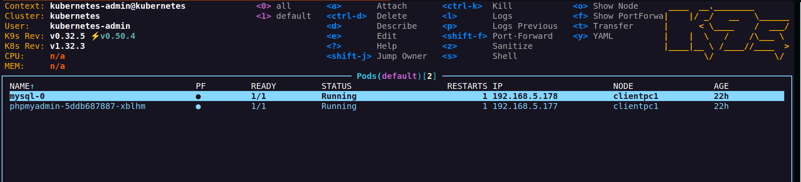
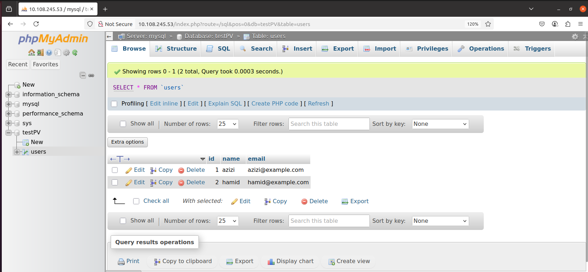

# 🐳 MySQL with Persistent Storage & phpMyAdmin on Kubernetes

This project deploys a **MySQL database with persistent storage** on a real Kubernetes cluster. It also includes automatic **database initialization** and a **phpMyAdmin UI** to interact with the database.

---

## Project Structure
 ```
├── init-db-configmap.yaml            # SQL file for DB + table + data
├── mysql-pvc.yaml                    # PersistentVolumeClaim (uses volume from node)
├── mysql-pv.yaml                     # Assign physical Valume from local system
├── mysql-secret.yaml                 # Secure MySQL root password
├── mysql-service.yaml                # MySQL service
├── mysql-statefulset.yaml            # MySQL StatefulSet    
└── phpmyadmin-deployment.yaml        # Web-based MySQL UI
``` 
## Below are given files:
* [init-db-configmap.yaml](init-db-configmap.yaml)     
* [mysql-pvc.yaml](mysql-pvc.yaml)              
* [mysql-pv.yaml](mysql-pv.yaml)              
* [mysql-secret.yaml](mysql-secret.yaml)         
* [mysql-service.yaml](mysql-service.yaml)         
* [mysql-statefulset.yaml](mysql-statefulset.yaml)      
* [phpmyadmin-deployment.yaml](phpmyadmin-deployment.yaml) 
## Apply the yaml files in order:
```
kubectl apply -f mysql-secret.yaml
kubectl apply -f mysql-pv.yaml
kubectl apply -f mysql-pvc.yaml
kubectl apply -f init-db-configmap.yaml
kubectl apply -f mysql-service.yaml
kubectl apply -f mysql-statefulset.yaml
kubectl apply -f phpmyadmin-deployment.yaml
```
## Check if all running:
```
azizivakili@kubernetes:~$ kubectl get all
NAME                              READY   STATUS    RESTARTS      AGE
pod/mysql-0                       1/1     Running   1 (22h ago)   22h
pod/phpmyadmin-5ddb687887-xblhm   1/1     Running   1 (22h ago)   22h

NAME                 TYPE           CLUSTER-IP      EXTERNAL-IP   PORT(S)        AGE
service/kubernetes   ClusterIP      10.96.0.1       <none>        443/TCP        13d
service/mysql        ClusterIP      None            <none>        3306/TCP       22h
service/phpmyadmin   LoadBalancer   10.108.245.53   <pending>     80:31360/TCP   22h

NAME                         READY   UP-TO-DATE   AVAILABLE   AGE
deployment.apps/phpmyadmin   1/1     1            1           22h

NAME                                    DESIRED   CURRENT   READY   AGE
replicaset.apps/phpmyadmin-5ddb687887   1         1         1       22h

NAME                     READY   AGE
statefulset.apps/mysql   1/1     22h
```
See the cluster also in K9S:

## Open Phpmyadmin page to check Mysql connectivity and Tables!
Here we see that Phpmyadmin show "testDB" database and its table named "users"!


